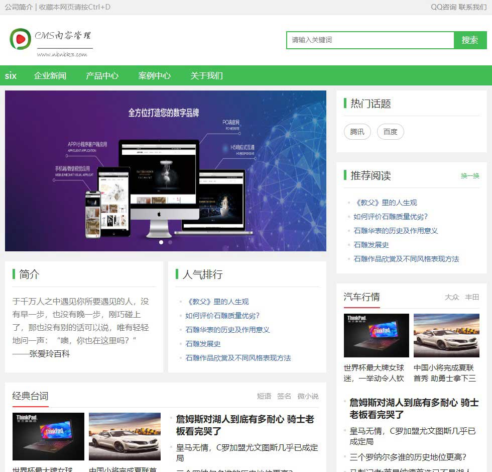
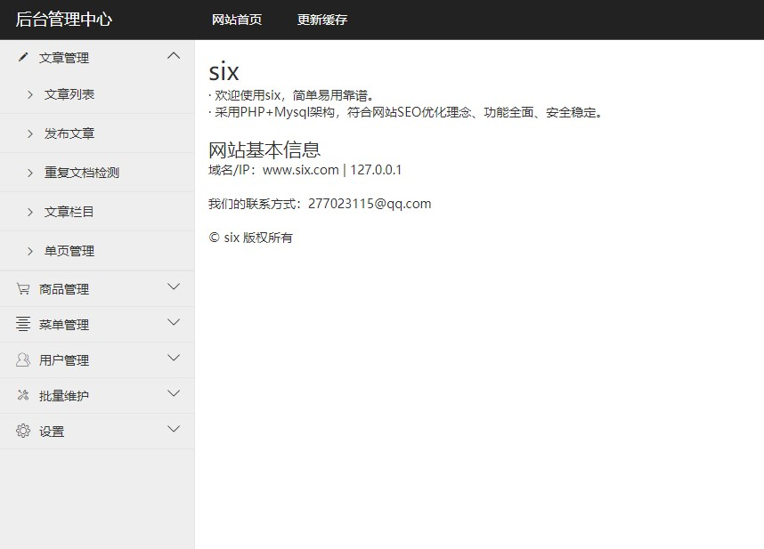

# SIX
基于thinkphp6管理系统，采用layui框架，thinkphp6权限系统，tp6管理系统

## 效果截图

PC端

后台管理

## 说明

1、基于layui和ThinkPHP6.0的快速后台开发框架，完善的RBAC权限管理。

2、PHP+Mysql

3、后台登录：http://www.six.com/fladmin/login，账号：admin888，密码：123456

4、恢复后台默认账号密码：http://www.six.com/fladmin/login/recoverpwd

5、tp6开源cms系统，适合博客、中小企业建站二次开发。

6、http://www.six.com只是示例域名，需换成自己绑定的域名

<strong>PC入口</strong>：http(s)://+PC域名+/

7、后台功能
1) 文章管理：增删改查，栏目管理
2) 单页管理
3) RBAC权限管理，管理员/角色管理，权限授权
4) 商品管理：商品品牌，商品分类
5) 轮播图
6) 友情链接
7) 系统参数配置

8、前台功能
1) 公司介绍
2) 产品中心
3) 新闻动态
4) 联系我们
5) 友情链接

## 安装

跟thinkphp6安装一样，只是多了一步数据库导入

1、 导入数据库

1) 打开根目录下的six.sql文件，替换文件里面的 http://www.six.com 为自己的站点根网址，格式：http(s)://+域名

2) 导入数据库，导入完成之后，因为数据表有索引，需要修复表不然很容易报错

2、 修改数据库连接参数

打开.env文件,修改相关配置

3、 根目录执行 composer install 或 composer update 示例：php composer.phar install 或 php composer.phar update

4、 登录后台->系统设置->系统配置参数，更新配置：http://www.six.com/fladmin/index/upcache

Linux系统文件/目录权限

 + extend/wxJsSdk目录设置成可读写777
 + runtime目录设置成可读写777
 + public/uploads目录设置成可读写777
 + public/index.php文件设置成只读444

## 注意

站点只能放在根目录

public目录做为网站根目录，入口文件在 public/index.php

## 环境要求

* php7.1.0+
* mysql5.6+
* PDO PHP Extension
* MBstring PHP Extension
* CURL PHP Extension
* 打开rewrite

> ThinkPHP6.0的运行环境要求PHP7.1+。

## 目录结构

初始的目录结构如下：

~~~
www  WEB部署目录（或者子目录）
├─app           应用目录
│  ├─api                API目录主要提供接口
│  ├─common             公共模块目录（可以更改）
│  ├─fladmin            后台管理目录
│  ├─index              PC端目录
│  ├─app_name           应用目录
│  │  ├─common.php      函数文件
│  │  ├─controller      控制器目录
│  │  ├─model           模型目录
│  │  ├─view            视图目录
│  │  ├─config          配置目录
│  │  ├─route           路由目录
│  │  └─ ...            更多类库目录
│  │
│  ├─common.php         公共函数文件
│  └─event.php          事件定义文件
│
├─config                全局配置目录
│  ├─app.php            应用配置
│  ├─cache.php          缓存配置
│  ├─console.php        控制台配置
│  ├─cookie.php         Cookie配置
│  ├─database.php       数据库配置
│  ├─filesystem.php     文件磁盘配置
│  ├─lang.php           多语言配置
│  ├─log.php            日志配置
│  ├─middleware.php     中间件配置
│  ├─route.php          URL和路由配置
│  ├─session.php        Session配置
│  ├─trace.php          Trace配置
│  └─view.php           视图配置
│
├─public                WEB目录（对外访问目录）
│  ├─index.php          入口文件
│  ├─router.php         快速测试文件
│  ├─.htaccess          用于apache的重写
│  └─nginx.txt          用于nginx的重写
│
├─extend                扩展类库目录
├─runtime               应用的运行时目录（可写，可定制）
├─vendor                Composer类库目录
├─.env                  环境变量文件
├─.example.env          环境变量示例文件
├─composer.json         composer 定义文件
├─LICENSE.txt           授权说明文件
├─README.md             README 文件
├─think                 命令行入口文件
~~~

## 使用许可

six是基于ThinkPHP6的开源系统，它完全免费，可以自由的进行二次开发。

## Bug及建议

如有Bug欢迎开Issues或者邮箱 277023115@qq.com 留言，如有好的建议以及意见也欢迎交流。

